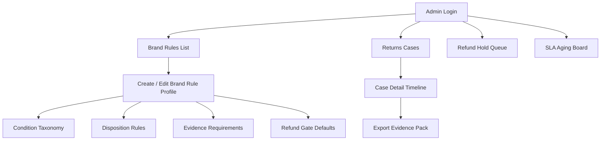
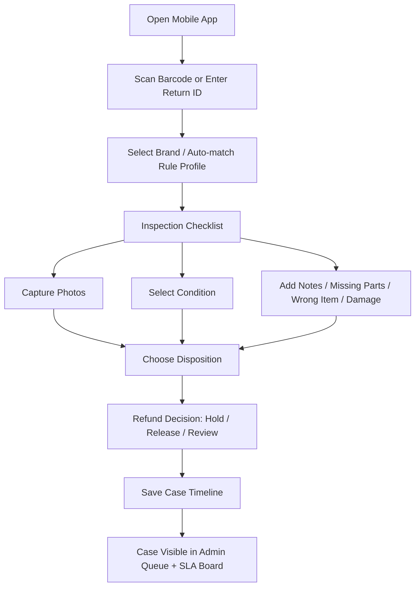

# 6POS P0 Development Plan

最后更新时间：2026-04-03 America/Los_Angeles

## Goal

在你买下 `6POS Extended` 后，用 **2 周左右** 做出一个可 demo、可内部试用、可支持首个付费试单交付的 P0 版本。

这个 P0 的唯一目标是：

**把 `6POS` 从 POS 壳子改成一个能跑通 `mobile inspection + evidence capture + refund gate + SLA visibility` 的 returns 控制层。**

## Evidence From Files

- Fact: [returns-disposition-final-direction.md](/Users/mikezhang/Desktop/projects/readybook/returns-disposition-final-direction.md) 已经把最终主方向收敛为 `Multi-brand 3PL Returns Rules Console`。
- Fact: 同一文档明确了 P0 必须包含：
  - `Mobile inspection console`
  - `Brand-specific rule profiles`
  - `Condition taxonomy`
  - `Disposition router`
  - `Fraud evidence capture`
  - `Refund hold / release queue`
  - `Case notes + photo timeline`
  - `Chargeback-ready evidence export`
- Fact: [returns-disposition-final-direction.md](/Users/mikezhang/Desktop/projects/readybook/returns-disposition-final-direction.md) 明确了边界：
  - 不替换 shopper portal
  - 不替换 WMS 的库存事实
  - 只控制货到仓后的判断、证据、退款和 SLA
- Fact: [returns-decision-support-review-launch-plan.md](/Users/mikezhang/Desktop/projects/readybook/returns-decision-support-review-launch-plan.md) 明确了最快试单卖的是 `Returns Decision Support Review`，而不是先卖软件。
- Fact: [6pos-returns-rebuild-feature-competitor-plan.md](/Users/mikezhang/Desktop/projects/readybook/6pos-returns-rebuild-feature-competitor-plan.md) 已经把 `6POS` 定义为：
  - mobile app shell
  - barcode / inventory / refund primitives
  - Laravel + Flutter 可改造底盘
- Fact: [6pos-returns-rebuild-feature-competitor-plan.md](/Users/mikezhang/Desktop/projects/readybook/6pos-returns-rebuild-feature-competitor-plan.md) 明确了第一版真正要赢的只有 4 个点：
  - `multi-brand rules`
  - `mobile inspection`
  - `evidence + refund gate`
  - `SLA aging visibility`
- Assumption: 你买到的 `6POS Extended` 包含完整的 Laravel admin 和 Flutter mobile source，而不是只含编译产物。
- Assumption: 6POS 当前已有的 barcode / refund / product / role / upload 基础足够稳定，可以复用而不是推翻重来。
- Assumption: 第一版先用单仓或单 location demo，不急着做多仓复杂路由。

## Scope

### In Scope

- `6POS` 后台中的 returns rules 配置层
- Flutter 端 inspection 执行流
- evidence capture
- refund hold / release queue
- SLA aging board
- chargeback-ready export

### Out Of Scope

- shopper return portal
- label creation
- exchange logic
- payment processor API 提交
- full WMS replacement
- portal sync adapter
- automated recovery routing

## P0 Outcome

如果 P0 完成，应该能现场演示这个流程：

1. 后台为品牌 A 配置退货规则  
2. 仓库人员在手机端扫码 / 输入 return id  
3. 系统按品牌 A 规则提示要拍哪些照片、填哪些字段  
4. 仓库人员选择 condition 和 disposition  
5. case 进入 `refund hold / release` 队列  
6. 后台能看到该 case 的完整时间线和 SLA 状态  
7. 一键导出 `chargeback-ready evidence pack`

## P0 Modules

| 模块 | 最小可交付内容 | Owner |
|---|---|---|
| `Rules Profiles` | 品牌级规则表：condition、disposition、evidence requirement、refund default | Me |
| `Mobile Inspection` | scan / input id -> pick brand -> inspect -> capture evidence -> select outcome | Me |
| `Evidence Pack` | 照片、备注、字段、时间线、导出模板 | Me |
| `Refund Gate` | hold / release / review 状态流 + 基本操作 | Me |
| `SLA Board` | case age、brand backlog、stuck cases | Me |

## Page / Screen Flow

### Backend Flow

### Mobile Inspection Flow

## Backend Information Architecture

### 1. Brand Rules List

这个页面是第一版的控制中心。

必须能看到：
- brand name
- active / inactive
- default refund behavior
- required evidence count
- disposition options
- last updated

必须能做：
- create
- edit
- duplicate from existing brand
- archive

### 2. Brand Rule Profile Edit

需要拆成 4 个区块：

1. `Condition Taxonomy`
- unopened
- like new
- opened resaleable
- opened damaged
- wrong item
- empty box
- missing parts
- custom

2. `Evidence Requirements`
- minimum photos
- required photo types
- note required or optional
- serial / SKU required or optional

3. `Disposition Options`
- restock
- hold
- return to brand
- refurb
- destroy
- quarantine

4. `Refund Defaults`
- auto hold
- auto release
- supervisor review

### 3. Returns Cases

列表页字段：
- case id
- return id
- brand
- SKU / item
- current condition
- current disposition
- refund status
- SLA age
- assigned user
- last update

过滤器：
- brand
- refund status
- disposition
- SLA breach
- evidence missing

### 4. Case Detail Timeline

这是最重要的单 case 页面。

必须包含：
- 基础信息
- 照片区
- inspection answers
- condition
- disposition
- refund decision
- notes
- status history
- exported evidence pack button

### 5. Refund Hold Queue

必须有三列：
- `Hold`
- `Ready to Release`
- `Needs Review`

每条 case 卡片要直接看到：
- brand
- item
- reason
- evidence completeness
- SLA age

### 6. SLA Aging Board

第一版只做最值钱的 4 张卡：
- returns over 24h unjudged
- returns over 48h stuck in hold
- brands with highest backlog
- cases missing required evidence

## Mobile UX Requirements

### Hard Requirements

- 手机浏览器或 Flutter app 任一端必须能顺手执行
- 单件退货判断控制在 `3-5` 次核心点击
- 拍照必须顺手，不允许先存本地再上传
- 如果品牌规则要求 `3` 张图，界面必须明确提示还差几张
- 如果 evidence 不完整，不能直接进入 `Ready to Release`

### Interaction Rules

- 优先扫码，不强依赖手输
- 所有 condition 选项用大按钮，不用下拉
- disposition 选项按规则过滤，不展示无关选项
- 现场人员默认只看当前任务，不看复杂后台

## Suggested Data Model Additions

这是基于现有 `6POS` 概念层之上新增的最小模型。

| Model | Purpose |
|---|---|
| `brand_rule_profiles` | 每个品牌的 returns 规则 |
| `brand_rule_conditions` | condition taxonomy |
| `brand_rule_evidence_requirements` | required photos / notes / identifiers |
| `return_cases` | 一件退货 case 的主记录 |
| `return_case_media` | 照片 / 附件 |
| `return_case_events` | timeline / audit trail |
| `refund_gate_decisions` | hold / release / review |

## Build Plan

| Phase | Tasks | Output | Exit Criteria |
|---|---|---|---|
| `A. Package Validation` | 解压源码、确认 Laravel admin 和 Flutter source 都在、跑通本地环境、确认 barcode/refund/upload 基础可用 | running local dev stack | 能在本机登录 web 和 mobile demo |
| `B. Domain Rewrite` | 重命名 returns/refund 相关概念、加 brand rules tables、加 return_cases 主表 | schema + admin skeleton | 能在后台创建品牌规则并保存 |
| `C. Mobile Inspection P0` | 做扫码/输入 return id、condition 选择、拍照、notes、disposition、refund status | mobile inspection flow | 单 case 能完整创建并保存 |
| `D. Admin Control P0` | 做 case list、case detail timeline、refund queue、SLA board | admin workflow | 后台能追踪每个 case |
| `E. Export + Demo Prep` | evidence pack 导出、demo seed data、1-2 个品牌样例规则 | demo-ready P0 | 能用样例跑完整故事 |

## Exact Development Checklist

### Day 1: Purchase-After Validation

- [ ] 解压 `6POS Extended`
- [ ] 确认包含 Laravel admin source
- [ ] 确认包含 Flutter source
- [ ] 本地跑起 web
- [ ] 本地跑起 mobile
- [ ] 找到 barcode、refund、image upload、roles 相关代码位置
- [ ] 确认 license / docs / install guide 完整

### Backend Checklist

- [ ] 增加 `Brand Rules` 菜单
- [ ] 完成 `Brand Rule Profile` CRUD
- [ ] 完成 `Condition Taxonomy` 编辑
- [ ] 完成 `Evidence Requirement` 编辑
- [ ] 完成 `Disposition Options` 编辑
- [ ] 完成 `Refund Default` 编辑
- [ ] 增加 `Return Cases` 列表
- [ ] 增加 `Case Detail Timeline`
- [ ] 增加 `Refund Hold Queue`
- [ ] 增加 `SLA Aging Board`
- [ ] 增加 `Chargeback-ready export`

### Mobile Checklist

- [ ] 新增 `Inspect Return` 入口
- [ ] 支持扫码或手动输入 return id
- [ ] 支持品牌匹配
- [ ] 支持 condition 选择
- [ ] 支持拍照上传
- [ ] 支持 notes / issue fields
- [ ] 支持 disposition 选择
- [ ] 支持 refund hold / release / review
- [ ] 提交后回写到后台 case timeline

### Demo Checklist

- [ ] 预置 `3` 个品牌规则：
  - Brand A: apparel
  - Brand B: electronics
  - Brand C: beauty / consumables
- [ ] 每个品牌至少 `2` 个真实差异化规则
- [ ] 准备 `5` 个 demo returns cases
- [ ] 准备一个 `evidence pack` 导出样例 PDF/HTML

## Risks

| Risk | Prob. | Impact | Mitigation |
|---|---|---|---|
| Flutter source 结构很乱，改起来比预期慢 | 中 | 高 | Day 1 先核代码结构，不行就改成 responsive mobile web 先跑 |
| 6POS refund model 太 retail，不适合 direct reuse | 高 | 中 | 只借概念，不强绑旧模型 |
| barcode / upload 功能实际上不好改 | 中 | 中 | 第一天就定位代码入口，必要时先做 manual ID input |
| 后台概念过重，字段命名混乱 | 高 | 中 | 先加新模块，不强行复用所有 POS 术语 |
| scope 漂到 full WMS / shopper portal | 高 | 高 | 严格按本文件 in-scope / out-of-scope 执行 |

## Checkpoints

- Day 1:
  - 本地环境跑通
  - brand rules 表结构定下来
  - mobile 端找到 inspection flow 入口位

- Day 3:
  - 能创建 brand rule
  - 能在 mobile 端创建一个 case

- Day 5:
  - case timeline、refund queue、SLA board 出第一版

- Week 2:
  - demo 数据可跑完整流程
  - 能支撑 `Returns Decision Support Review` 的样例演示

- Kill threshold:
  - 如果 Day 1 发现 Flutter 源码不可维护，立即转 `responsive mobile web` 路线
  - 如果 Day 3 还做不出完整 case creation，就必须砍掉 `chargeback export` 以外的非核心项
  - 如果 Week 2 仍无法形成稳定 demo，不继续扩功能，先停在服务交付

## Final Recommendation

买完 `6POS Extended` 后，不要先说“做产品”，而要按这个顺序推进：

1. 跑通环境  
2. 建 `brand rules`  
3. 做 `mobile inspection`  
4. 做 `refund gate + case timeline`  
5. 做 `SLA board + evidence export`  

一句话：

**P0 不是做一个完整 returns 系统。P0 只是把 `6POS` 改造成一个能跑通 warehouse-side judgment 的 demoable control layer。**
